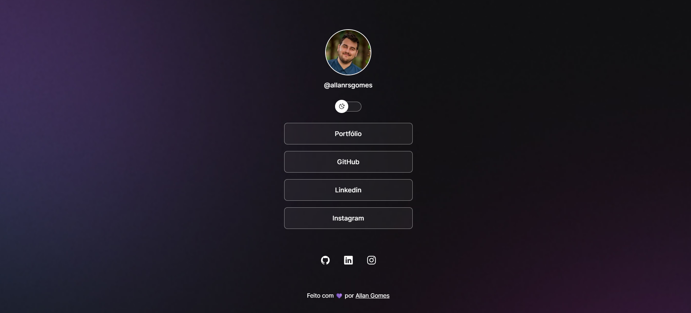

<h1 align="center"> DevLinks </h1>

Aplicativo web que permite organizar links em um único lugar.

  <a href="#-tecnologias">Tecnologias</a>&nbsp;&nbsp;&nbsp;|&nbsp;&nbsp;&nbsp;
  <a href="#-projeto">Projeto</a>&nbsp;&nbsp;&nbsp;|&nbsp;&nbsp;&nbsp;
  <a href="#-layout">Layout</a>&nbsp;&nbsp;&nbsp;|&nbsp;&nbsp;&nbsp;
  <a href="#memo-licença">Licença</a>

  

 

  

## 🚀 Tecnologias

Esse projeto foi desenvolvido com as seguintes tecnologias:

- HTML e CSS
- JavaScript
- Git e Github
- Figma

## 💻 Projeto

Aplicativo web que permite organizar links para seus perfis e páginas em várias redes sociais em um único lugar.

## :memo: Licença

Esse projeto está sob a licença MIT.

---

Feito com ♥ by [Allan Gomes](https://www.linkedin.com/in/allanrsgomes/)
